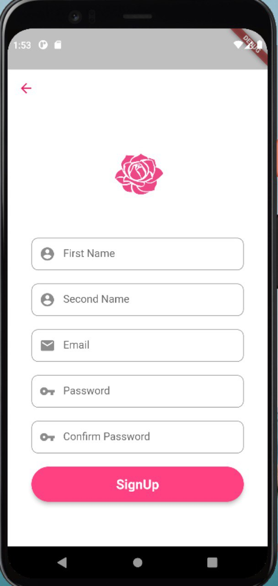
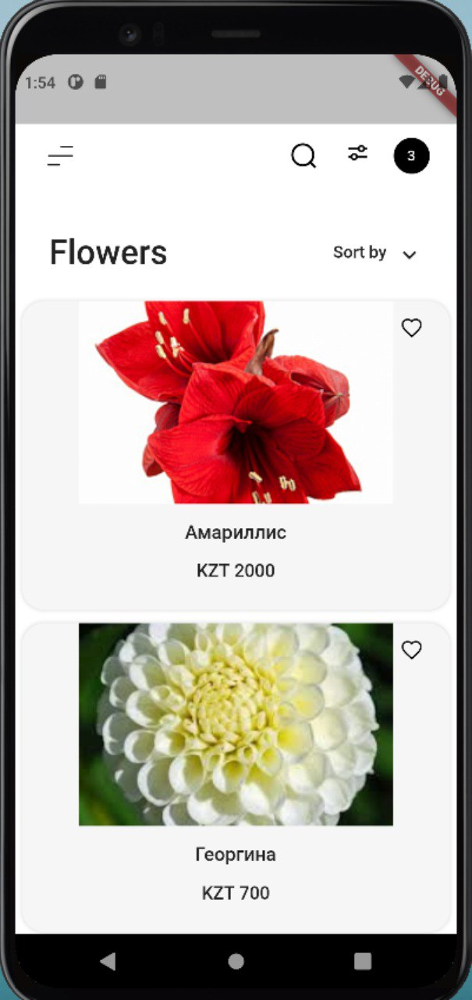
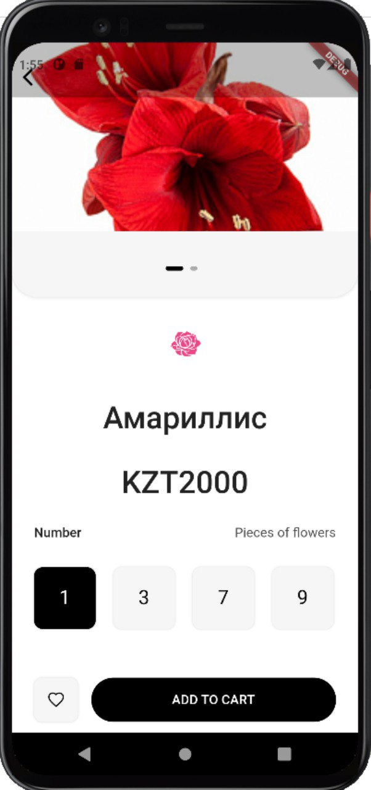

# Flower shop

Mobile application written of flutter

## About project

This project is a starting point for a Flutter application.

This application is an online flower shop. And with all the convenience for the client. Through this application, they can choose the number of flowers and decoration or design.Through the search, you can search for the desired flower. Or you can use a filter to make it easier to search. And prices can be sorted in descending and ascending order. there is a function of favorites and they can be saved in favorites by clicking on the heart.

## Mentor

- [Bissenbay Dauletbayev](https://github.com/bissenbay) - b.dauletbayev@sdu.edu.kz

## Members 
- [Berik Tolebi](https://github.com/tulebi) - 200113011@stu.sdu.edu.kz
- [Alisher Zhorakhanov](https://github.com/zhorakhanov1) - 180107024@stu.sdu.edu.kz
- [Alizhomart Shukayev](https://github.com/alizhomart) - 180107176@stu.sdu.edu.kz

## Goal

Make it a convenience for customers

## Scope and Features

Same UI and Business Logic in All Platforms
Similar to Native App Performance

## Project structure 

- Login screen 
- Registration screen
- Home page
- Menu page 
- Product detail page
## Users
Anyone who wants to buy a flower can use this application.

## Screenshots 

## Final report
https://docs.google.com/document/d/1Ta_VahX_vRAH9obMkok8AmP4vDk5wcJ8PCelF3e9kko/edit?usp=sharing
## License & copyright
© Suleyman Demirel University
